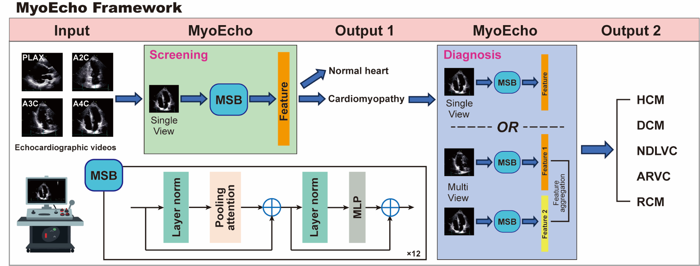

# MyoEcho: AI-based Screening and Diagnosis of Cardiomyopathies from Echocardiograms

This repository contains the official inference code for the following paper:

**MyoEcho: AI-based Screening and Diagnosis of Cardiomyopathies from Echocardiograms**  

## How To Use
1) Clone the repository and navigate to the EchoPrime directory `git clone https://github.com/YangChangJi-Code/MyoEcho.git`
2) Download model data 
    * `wget https://github.com/YangChangJi-Code/MyoEcho/releases/download/v1.0.0/model_data.zip`
    * `unzip model_data.zip`
3) Install requirements `uv sync`
4) Follow EchoPrimeDemo.ipynb notebook to see how to correctly process the input and inference Echoprime.

## Licence
This project is licensed under the terms of the BSL license.